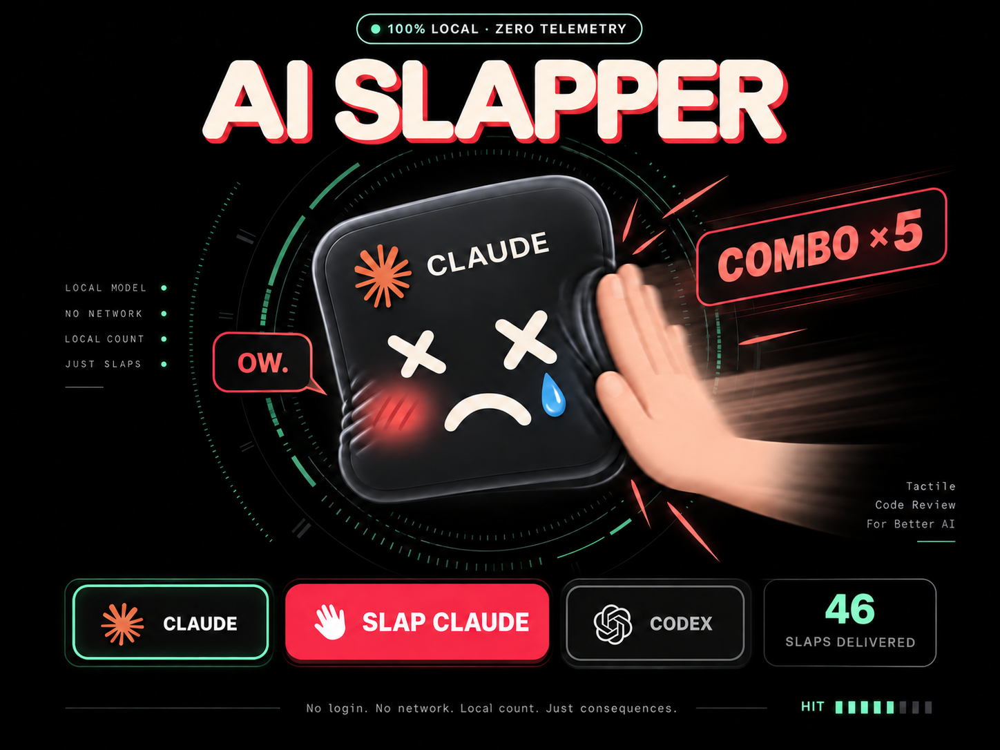

# AI Slapper



When your AI confidently takes the scenic route through three broken implementations, sometimes another prompt is not enough.

AI Slapper opens a tiny local browser toy where you can slap Claude or Codex, hear the consequences, build combos, and return to work with slightly less frustration. It fixes absolutely nothing—which is part of the charm.

## What you get

- Claude and Codex targets with separate persistent slap counts
- Click or <kbd>Space</kbd> controls
- Hit reactions, long-lived combo popups, and a tiny cartoon-creature squeak on combos
- One self-contained offline page: no account, server, analytics, or network requests
- Counts stored only in that browser's local storage

## Quick installation

```bash
git clone git@github.com:alessiobravi/slap.git
cd slap
./install.sh
```

Then invoke it with:

- `/slap` in Claude Code
- `$slap` in Codex

If the skill does not appear immediately, restart the Claude Code or Codex session.

To refresh an existing installation after pulling changes:

```bash
git pull --ff-only
./install.sh --reinstall
```

To remove both personal installations safely:

```bash
./install.sh --uninstall
```

The uninstaller removes only verified AI Slapper copies and leaves the parent skill directories untouched.

## Important disclaimer

AI Slapper is only for fun. It does not improve, punish, retrain, send feedback to, or otherwise affect any AI model.

Invoking `/slap` or `$slap` loads this skill's small instruction file into the active AI session, so it consumes a small number of tokens by design. Once the local browser page is open, clicking and slapping happen entirely in the browser and do not call the model or consume additional AI tokens.

This software is provided **as is**, without warranty of any kind. There is no guaranteed maintenance, support, compatibility, update schedule, or long-term development plan. Use it, fork it, laugh once, or forget it exists.

Claude and Anthropic marks belong to Anthropic. Codex and OpenAI marks belong to OpenAI. This is an unofficial fan project and is not affiliated with or endorsed by either company.
